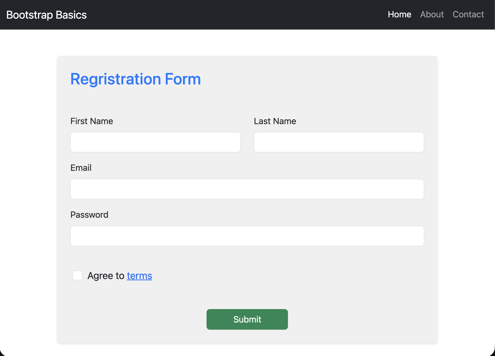
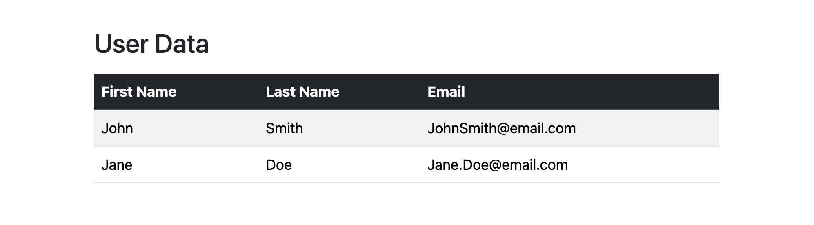
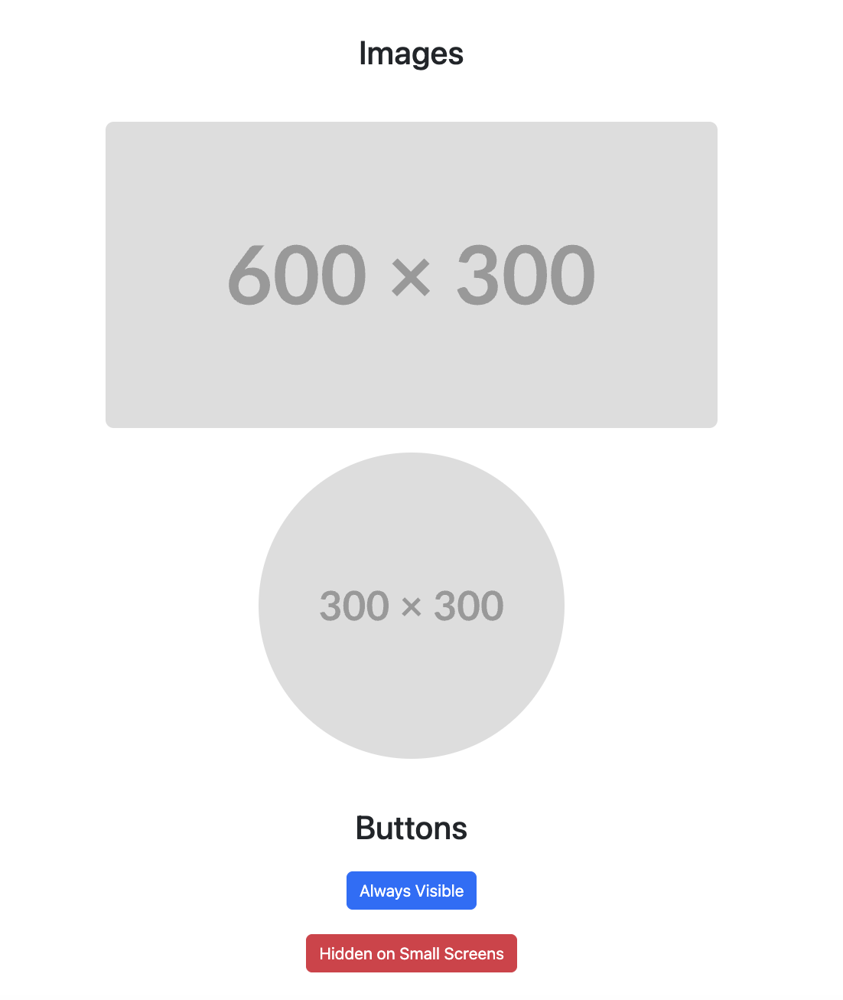

# Bootstrap Basics

## Project Description

This project demonstrates the use of Bootstrap 5 to create a responsive and modern web page. It includes a navigation bar, a registration form, a user data table, images, and buttons with various Bootstrap utilities applied.The focus of this assignment is to apply Bootstrap components, grid layouts, utilities, and responsive design techniques.

## Features

- Responsive grid system for flexible layouts
- Typography styles
- Form elements styling
- Buttons with hover effects
- Navbar component
- Table with Bootstrap styling
- Image styling and responsiveness
- Utility classes for spacing, colors, and display properties.

## Installation

1. Clone the repository:
    ```
    git clone https://github.com/yourusername/bootstrap-basics.git
    ```
2. Open `index.html` in your web browser to view the project.

You can include Bootstrap in your project via CDN:

```html
<link
	href="https://cdn.jsdelivr.net/npm/bootstrap@5.3.0/dist/css/bootstrap.min.css"
	rel="stylesheet"
/>
<script src="https://cdn.jsdelivr.net/npm/bootstrap@5.3.0/dist/js/bootstrap.bundle.min.js"></script>
```

Or install using npm:

```bash
npm install bootstrap
```

## Usage

- Use the navigation bar to explore different sections.
- Fill out the registration form and submit.
- View user data in the table.
- Observe responsive images and buttons adapting to screen size.

## Screenshots

### Navbar + Form:



### User Data:



### Images/Buttons:



## Roadmap

- [ ] Add more component examples (cards, forms, navbars)
- [ ] Create advanced layout templates
- [ ] Add custom themes and Sass customization examples
- [ ] Write tutorials for common use cases
- [ ] Add content to the About and Contact pages

## Collaborators

Currently this project was developed independently.  
Future collaborators can be listed here.

Example format:

- Name — Role — GitHub Link
- Magali Bogarin - Developer - https://github.com/mbogarin

---

### Credits

- Classmates and mentors at coding temple

## Project Structure

```
bootstrap-basics/
│
├── index.html
├── styles.css
└── screenshots/
```

## Notes

- This project is intended as a learning resource and starting point for Bootstrap-based projects.
- This project uses Bootstrap 5 via CDN for quick setup and development. Custom styles are added in `styles.css`.
- Please feel free to fork, modify, and contribute improvements or examples!
- Ensure to update screenshots with relevant images showcasing your implemented features.
